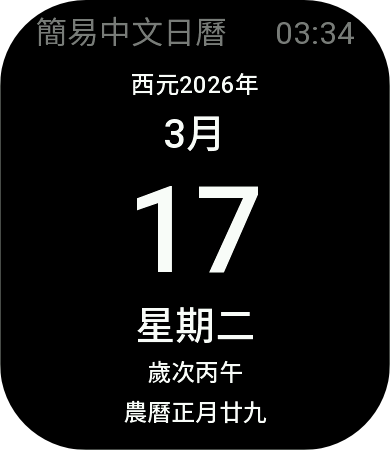
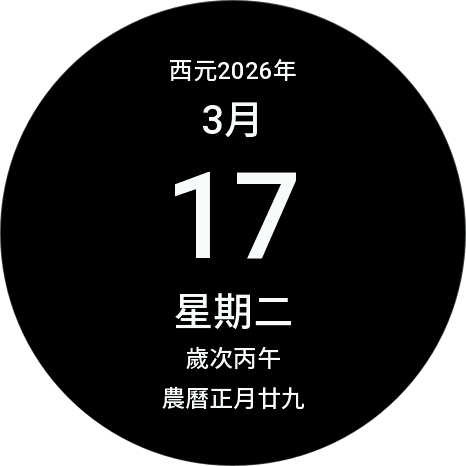

# Zepp-OS-Simple-Chinese-Calendar
簡單的Zepp OS中文日曆小程式

## 應用截圖





## 開發者模式的安裝方式

1. 請先啟用Zepp APP的開發者模式
2. 打開臨時檔案託管網站[https://litterbox.catbox.moe](https://litterbox.catbox.moe)
3. 下載Release頁面的zip包，由下方對應清單中找到裝置適用的zpk包，上傳到臨時托管網站
4. 打開QR碼生成網站[https://www.qrcode-monkey.](https://www.qrcode-monkey.com)
5. 將託管網站生成的URL改成 `zpkd1://` 開頭，例如
    ```
    zpkd1://litter.catbox.moe/5v0u9rd0nutml8vz.zpk
    ```
6. 改好的網址貼到QR碼生成網站，產生QR碼
6. 點選開發者模式右上方的"+"，之後點選"掃一掃"
7. 掃描產生出來的QR碼，或是按"Download PNG"下載到相簿後，使用"掃一掃"畫面上的"相簿"按鈕選擇剛剛下載的QR碼
8. 程式應該會開始安裝到手錶上，此時Zepp APP "開發者模式" 下 的 "小程序" 頁面可能會出現剛剛側載進來的的小程序
9. 檢查手錶的應用清單，應用應該已經安裝入手錶中！

## GitHub上傳版本差異

1. `Global` 字頭 (同時於Zepp應用商店送審中)，年份只有西元(公元)紀年，適用所有華語區的設備
2. `TW` 字頭，年分顯示包含西元以及民國紀年，更符合台灣的使用習慣

## 裝置對應表

(使用`packet_model_helper.py`自動產生)

```
檔案名稱: round_360-Apollo-360x360.zpk
主要型號: activeedge
------------------------------------------------------------
檔案名稱: round_454-NXP-454x454.zpk
主要型號: cheetah-round, trexultra
------------------------------------------------------------
檔案名稱: round_466-MHS-466x466.zpk
主要型號: active2-round, active2-round-2024, active3premium, trex3pro44
------------------------------------------------------------
檔案名稱: round_466-NXP-466x466.zpk
主要型號: gtr4
------------------------------------------------------------
檔案名稱: round_480-MHS-480x480.zpk
主要型號: activemax, balance2, trex3, trex3pro48, trexultra2
------------------------------------------------------------
檔案名稱: round_480-NXP-480x480.zpk
主要型號: balance
------------------------------------------------------------
檔案名稱: square_320-Apollo-320x380.zpk
主要型號: bip5, bip5unity
------------------------------------------------------------
檔案名稱: square_390-Apollo-390x450.zpk
主要型號: active
------------------------------------------------------------
檔案名稱: square_390-MHS-390x450.zpk
主要型號: active-2-square, bip6
------------------------------------------------------------
檔案名稱: square_390-NXP-390x450.zpk
主要型號: cheetah-square, gts4
```